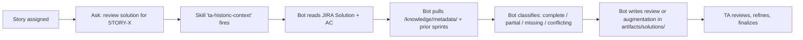
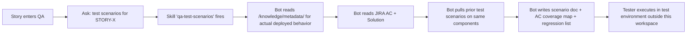

# Workflow Guide (v2)

End-to-end workflows for each role. Each role has a **companion skill** that auto-fires on intent — see `_cursor/skills/<role>/SKILL.md`. Pair this guide with `guidelines/<your-role>.md`.

---

## Workflow 1 — Sprint kickoff (Solution Architect)

```mermaid
flowchart LR
  A[Receive JIRA HTML export — required format] --> B[Drop in knowledge/sprints/Sprint N/]
  B --> B2[Run split-sprint-stories.py]
  B2 --> C[Run scripts/ to build indexes]
  C --> D[Skim AC-INDEX & SOLUTION-INDEX]
  D --> E[Ask Cursor: any conflicts vs Sprint N-1?]
  E --> F[Skill 'sa-cross-sprint-consistency' fires automatically]
  F --> G[Review the conflict report in artifacts/analysis/]
  G --> H[Flag risks in stand-up]
```



**Cursor prompts (the SA skill auto-fires):**
- *"List stories in Sprint N that share components with stories in Sprint N-1."*
- *"Find conflicts in Sprint N."*
- *"Validate AC for STORY-X."*
- *"Which Sprint N stories have no Solution column populated?"*
- *"Identify ACs that mention `[critical object]` and summarize the impact."*

---

## Workflow 2 — Tech design / review (Technical Architect)



**Key shift in v2:** the TA skill assumes a JIRA Solution already exists and the AI's job is to **review and augment**, not invent. Greenfield design is the exception, not the default.

**Cursor prompts (the TA skill auto-fires):**
- *"Review the technical solution for STORY-X."*
- *"Is the JIRA Solution for STORY-X complete?"*
- *"What's missing from STORY-X's solution (security, integration, edge cases)?"*
- *"Compare STORY-X's planned approach with prior solutions for [Component]."*
- *"Generate a Mermaid sequence diagram for STORY-X."*

---

## Workflow 3 — Story prep (Developer)

```mermaid
flowchart LR
  A[Pick story from sprint] --> B[Ask: explain STORY-X technically]
  B --> C[Skill 'dev-story-prep' fires]
  C --> D[Bot reads /knowledge/metadata/ for current state]
  D --> E[Bot reads JIRA Solution + AC]
  E --> F[Bot pulls prior touchpoints + patterns]
  F --> G[Bot writes dev prep brief in artifacts/analysis/]
  G --> H[Dev opens code repo, branches off]
  H --> I[Implement & PR — outside this workspace]
```



**Cursor prompts (the dev skill auto-fires):**
- *"Explain STORY-X in technical terms."*
- *"What components does STORY-X touch?"*
- *"What edge cases should I watch for in STORY-X?"*
- *"Unit-test scenarios for STORY-X."*
- *"Is there an existing pattern I should follow for STORY-X?"*

> The bot will not write code or test classes. Implementation happens in your DX repo.

---

## Workflow 4 — Test planning (QA / Tester)



**Cursor prompts (the QA skill auto-fires):**
- *"Test scenarios for STORY-X."*
- *"AC coverage for STORY-X."*
- *"Edge cases for STORY-X."*
- *"Regression scope for Sprint N."*
- *"Which previous stories touched [Component] and need re-testing?"*

> The bot will not write `@isTest` classes or automation scripts. Test code lives in your automation repo.

---

## Workflow 5 — Architecture decision

When a debate goes longer than 15 minutes, capture it.

```bash
# Use the QUICK-START recipe to scaffold an ADR
$EDITOR knowledge/architecture/ADR-NNN-title.md
```

Then in Cursor:
- *"Critique ADR-007. What are 3 scenarios where this decision could fail?"*
- *"List all ADRs that touch the same component as ADR-007."*

---

## Workflow 6 — Updating metadata documentation (source of truth)

After a deployment, the deployed state may have drifted from the original JIRA Solution. Keep `/knowledge/metadata/` accurate so the AI uses the right ground truth.

```bash
NAME=Account; TYPE=object
mkdir -p "knowledge/metadata/${TYPE}s"
$EDITOR "knowledge/metadata/${TYPE}s/${NAME}.md"
```

If the deployment differs from what JIRA said, fill in the optional **"Drift From Intent"** section in the metadata template — it's a useful breadcrumb for future TAs.

---

## Anti-patterns

- ❌ Exporting JIRA stories as **CSV or pasted text**. Always export as **HTML** so strikethrough on superseded AC/Solution is preserved (the AI is wired to skip struck-through content per `_cursor/rules/jira-html-parsing.mdc`; flat formats lose that signal).
- ❌ Asking Cursor to read a 12,000-line sprint HTML directly. Always run `parse-sprint-html.py` first and read the index.
- ❌ Asking Cursor to write Apex / LWC / test classes in this workspace. The plan-and-ask-only rule will refuse; respect it.
- ❌ Asking Cursor "should I implement this?" — it will produce a design artifact instead.
- ❌ Hand-editing generated index files. They will be overwritten on next script run.
- ❌ Treating the JIRA Solution as gospel for current state — when metadata exists, metadata wins.
- ❌ Pasting customer data, real names, or secrets into any file.
