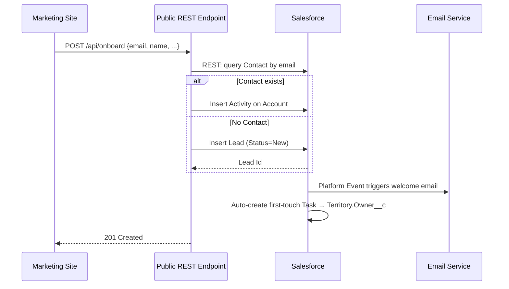

# PROJ-101 — Customer Onboarding (EXAMPLE)

> This is a fictional example to show how a solution doc reads end-to-end.
> Delete this file once your team has authored a few real ones.

**Story ID**: PROJ-101
**Sprint**: 3
**Author**: J. Doe (TA)
**Date**: 2026-04-29
**Status**: Draft

---

## Context

We need to let prospects self-onboard from the marketing site and land as Lead → Account → Contact in Salesforce, with a welcome email and a first-touch task assigned to the territory owner.

Source: see story PROJ-101 row in `knowledge/sprints/Sprint 3/sprint3-export.html`.

---

## Acceptance criteria (paraphrased from story)

- AC1: A POST to `/api/onboard` creates a Lead with status `New` if no matching email exists
- AC2: If the email matches an existing Contact, no new Lead is created; instead, an Activity is logged on the Account
- AC3: A welcome email is sent within 60 seconds
- AC4: A first-touch Task is created and assigned to the territory owner per `Territory.Owner__c`

---

## Proposed approach

### Components impacted

| Component | Type | Change |
|---|---|---|
| `Lead` | Object | New field: `Onboarding_Source__c` (Picklist) |
| `OnboardingService` | Apex Class | New |
| `Onboarding_Welcome_Email__e` | Platform Event | New |
| `Send_Welcome_Email_Flow` | Flow (PE-triggered) | New |
| `Create_First_Touch_Task_Flow` | Flow (record-triggered on Lead) | New |
| `Territory` | Object | reference existing `Owner__c` lookup |

---

## Alternatives considered

1. **Web-to-Lead** — rejected: no support for the existing-Contact branch
2. **Flow REST endpoint** — rejected: throughput concerns at marketing-launch peak
3. **Apex REST + Platform Events** *(chosen)* — clean separation, async email send

---

## Open questions

- [ ] Rate limit on `/api/onboard`?
- [ ] Welcome email template — owned by Marketing Cloud or native Email Template?

---

## Test plan reference

`artifacts/test-plans/PROJ-101-test-plan.md` (to be created)

## Related ADRs

- `knowledge/architecture/ADR-002-integration-pattern.md`
